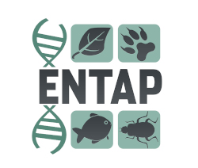

# EnTAPnf

[](https://github.com/systemsgenetics/entapnf/actions?query=workflow%3A%22nf-core+CI%22)
[](https://github.com/systemsgenetics/entapnf/actions?query=workflow%3A%22nf-core+linting%22)
[](https://www.nextflow.io/)
[](https://www.docker.com/)
[](https://sylabs.io/docs/)


## Introduction

EnTAPnf is a workflow that executes the [Eukaryotic Non-Model Transcriptome Annotation Pipeline (EnTAP)](https://entap.readthedocs.io/en/latest/).  EnTAP is designed to improve the accuracy, speed, and flexibility of functional gene annotation for both genomes and de novo assembled transcriptomes in non-model eukaryotes.  



EnTAPnf is constructed using [Nextflow](https://www.nextflow.io), a workflow tool to run tasks across multiple compute infrastructures in a very portable manner. It uses Docker/Singularity containers making installation trivial and results highly reproducible. The [Nextflow DSL2](https://www.nextflow.io/docs/latest/dsl2.html) implementation of this pipeline uses one container per process which makes it much easier to maintain and update software dependencies.

### What EnTAPnf does?
This repository provides a pipeline that does the following:

1.  Generates bulk input data for EnTAP:
    - Supports BLAST results vs NCBI nr, ExPASy SwissProt, ExPASy Tremble, NCBI RefSeq
    - Executes InterProScan
2.  Executes EnTAP by providing the bulk data input.

### When should you use the EnTAPnf pipeline?

EnTAP can run in a stand-alone manner and produce good results when the species is closely related to other species with high quality annotations in the [EggNOG](http://eggnog5.embl.de/#/app/home) database.  Otherwise, more information is needed. While EnTAP does perform [Diamond](https://github.com/bbuchfink/diamond) blast on a large genome or transcriptome, other tools such as [InterProScan](https://interproscan-docs.readthedocs.io/en/latest/) can be very time consuming to run on a stand alone machine.  

This workflow allows you to use a high-performance cluster (HPC), Kubernetes cluster or cloud computing resources to pre-compute the bulk data needed by EnTAP.

#### Protein-Protein Interaction Data

EnTAPnf can also provide additional information such as potential protein-protein interactions through alignment with the orthologs provided in the [STRING](https://string-db.org/) database.  

#### Integration with Tripal

[Tripal](http://tripal.info) is an open-source toolkit for the construction of online genome repositories.  Tripal provides infrastructure for genome databases around the world and these sites often need to refresh the functional annotations on the genomes they provide. EnTAPnf provides an easy way to allow these site to generate updated bulk data for upload to a Tripal site as well as to run EnTAP for high-quality in-silico annotations.

## Pipeline summary

1. Homology searching against specified databases using Diamond BLAST ([`Diamond`](https://github.com/bbuchfink/diamond)). Supported databases include:
    - NCBI nr
    - NCBI RefSeq
    - ExPASy SwissProt
    - ExPASy Trembl
    - STRING database
2. Execution of [InterProScan](https://interproscan-docs.readthedocs.io/en/latest/)

## Quick Start

1. Download databases. EnTAPnf must have available the databases. These can take quite a while to download and can consume large amounts of storage.  Use the bash scripts in the `scripts` folder to retrieve and index the databases prior to using this workflow.

1. Install [`Nextflow`](https://www.nextflow.io/docs/latest/getstarted.html#installation) (`>=21.10.3`)

2. Install any of [`Docker`](https://docs.docker.com/engine/installation/), [`Singularity`](https://www.sylabs.io/guides/3.0/user-guide/), [`Podman`](https://podman.io/), [`Shifter`](https://nersc.gitlab.io/development/shifter/how-to-use/) or [`Charliecloud`](https://hpc.github.io/charliecloud/) for full pipeline reproducibility ([`Conda`](https://conda.io/miniconda.html) is currently not supported); see [docs](https://nf-co.re/usage/configuration#basic-configuration-profiles)),

3. Download the pipeline and test it on a minimal dataset with a single command:

    ```console
    nextflow run systemsgenetics/entapnf -profile test,<docker/singularity/podman/shifter/charliecloud/conda/institute>
    ```

    > * Please check [nf-core/configs](https://github.com/nf-core/configs#documentation) to see if a custom config file to run nf-core pipelines already exists for your Institute. If so, you can simply use `-profile <institute>` in your command. This will enable either `docker` or `singularity` and set the appropriate execution settings for your local compute environment.
    > * If you are using `singularity` then the pipeline will auto-detect this and attempt to download the Singularity images directly as opposed to performing a conversion from Docker images. If you are persistently observing issues downloading Singularity images directly due to timeout or network issues then please use the `--singularity_pull_docker_container` parameter to pull and convert the Docker image instead. Alternatively, it is highly recommended to use the [`nf-core download`](https://nf-co.re/tools/#downloading-pipelines-for-offline-use) command to pre-download all of the required containers before running the pipeline and to set the [`NXF_SINGULARITY_CACHEDIR` or `singularity.cacheDir`](https://www.nextflow.io/docs/latest/singularity.html?#singularity-docker-hub) Nextflow options to be able to store and re-use the images from a central location for future pipeline runs.


4. Start running your own analysis!

    <!-- TODO nf-core: Update the example "typical command" below used to run the pipeline -->

    ```console
    nextflow run systemsgenetics/entapnf \
      -profile <docker/singularity/podman/shifter/charliecloud/conda/institute> \
      --batch_size 100 \
      --input <fasta file> \
      --data_sprot <directory with swissprot diamond index> \
      --data_refseq <directory with refseq diamond index> \
      --data_ipr <directory with InterProScan data> \
      --max_cpus 10 \
      --max_memory 6GB

    ```
- The `--batch_size` arguments indicates the number of sequences to process in each batch.
- It is recommended if using NCBI nr to set a large enough `--max_memory` size.

## Documentation

The systemsgenetics/entapnf pipeline has full online [documentation](https://entapnf.readthedocs.io/en/latest/).

## Credits

EnTAPnf was originally named AnnoTater and was written by the [Ficklin Computational Biology Team](http://ficklinlab.cahnrs.wsu.edu/) at [Washington State University](http://www.wsu.edu). Originally it was anticipated that it would provide very similar functionality as EnTAP, developed by the [Wegrzyn Plant Computational Genomics Lab](http://plantcompgenomics.com/) at the [University of Connecticut](http://www.uconn.edu). Rather than develop a competing workflow, AnnoTater was renamed to EnTAPnf and incorporates EnTAP to provide the high-quality in-silico annotations. EnTAPnf brings scalability to EnTAP.

Development of EnTAPnf was funded by the U.S. National Science Foundation (NSF) Award [#1659300](https://www.nsf.gov/awardsearch/showAward?AWD_ID=1659300&HistoricalAwards=false). It was funded separately from the EnTAP stand-alone tool. Please see the [EnTAP](https://entap.readthedocs.io/en/latest/) documentation for its funding sources.


## Contributions and Support

If you would like to contribute to this pipeline, please see the [contributing guidelines](.github/CONTRIBUTING.md).


## Citations

EnTAPnf is currently unpublished. For now, please use the GitHub URL when referencing.

<!-- TODO nf-core: Add bibliography of tools and data used in your pipeline -->
An extensive list of references for the tools used by the pipeline can be found in the [`CITATIONS.md`](CITATIONS.md) file.

You can cite the `nf-core` publication as follows:

> **The nf-core framework for community-curated bioinformatics pipelines.**
>
> Philip Ewels, Alexander Peltzer, Sven Fillinger, Harshil Patel, Johannes Alneberg, Andreas Wilm, Maxime Ulysse Garcia, Paolo Di Tommaso & Sven Nahnsen.
>
> _Nat Biotechnol._ 2020 Feb 13. doi: [10.1038/s41587-020-0439-x](https://dx.doi.org/10.1038/s41587-020-0439-x).
