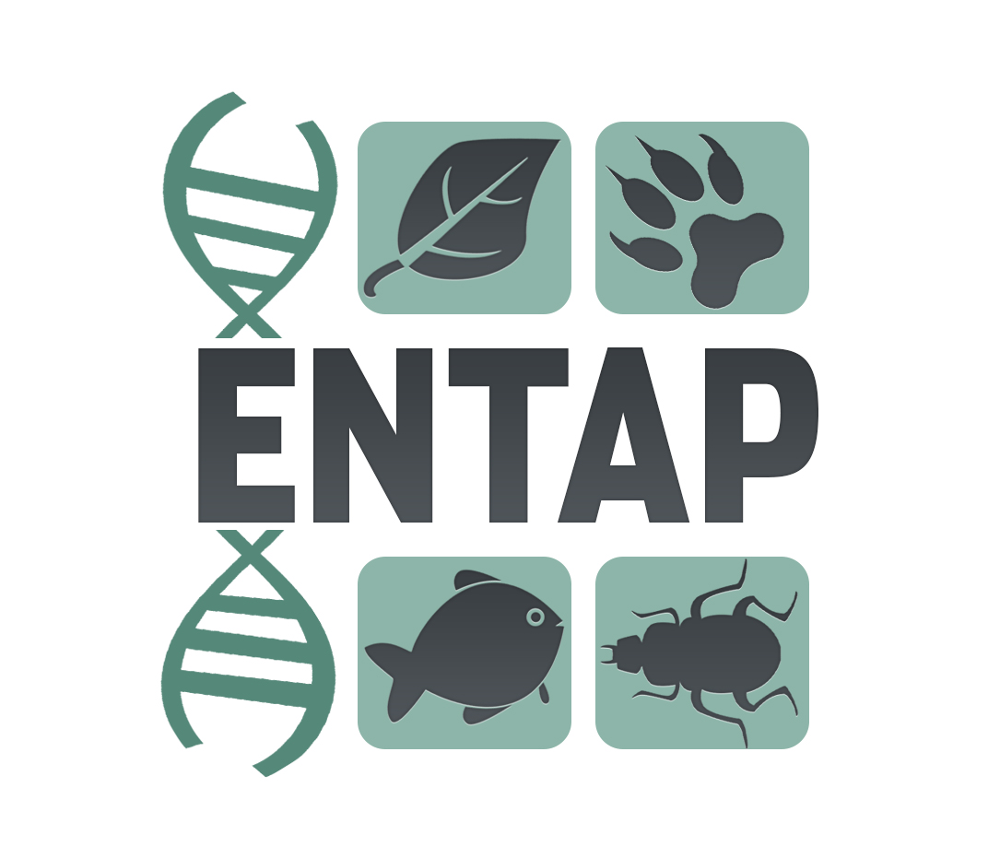

# Welcome to EnTAP-nf

The Eukaryotic Non-Model Transcriptome Annotation Pipeline (EnTAP) is designed to improve the accuracy, speed, and flexibility of functional gene annotation for *de novo* assembled transcriptomes in non-model eukaryotes.  You can learn more about EnTAP here:  https://entap.readthedocs.io/en/latest/

The functional tools supported by EnTAP can be run on a stand-alone machine, however when an HPC cluster or Cloud infrastructure is available, EnTAP-nf can be used!  EnTAP-nf is a Nextflow implementation of the EnTAP pipeline.
